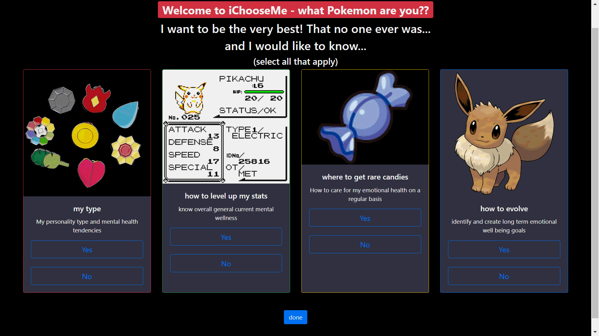

# iChooseMe

*`iChooseMe`* is a personality test and mental health coaching app. Click through the prompt to see what pokemon you are, what your strength and weaknesses are, and how you can imporve you mental health   `iChooseme` can help you:
- take a snap shot of your overall emotional health
- teach you how to care for your emotional well being on a regular basis
- create long term goals for your mental health

## Table of Contents

1. [Requirements](#requirements)
1. [Usage](#Usage)

## Requirements

- `Node` v10.13.0 (LTS as of May 2019) or higher
- `yarn` or `npm`

## Deployment

#### Server
> 1. Install dependencies with `yarn` or `npm install`
> 1. The server launch script is `server/index.js`
> - The server uses port `3000` by default, but you may set it using an environment variable (`process.env.PORT`)

#### Client
> The client side is built using webpack:
>> `yarn start` or `npm run start`: Initiates a test server locally, used for development
>
>> `yarn build` or `npm run build`: Builds the client-side files for deployment